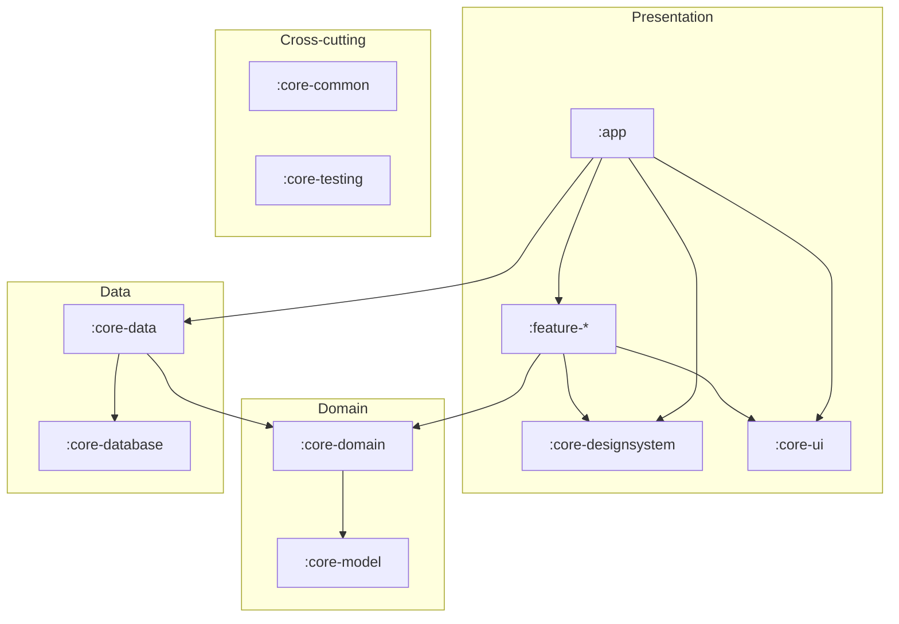
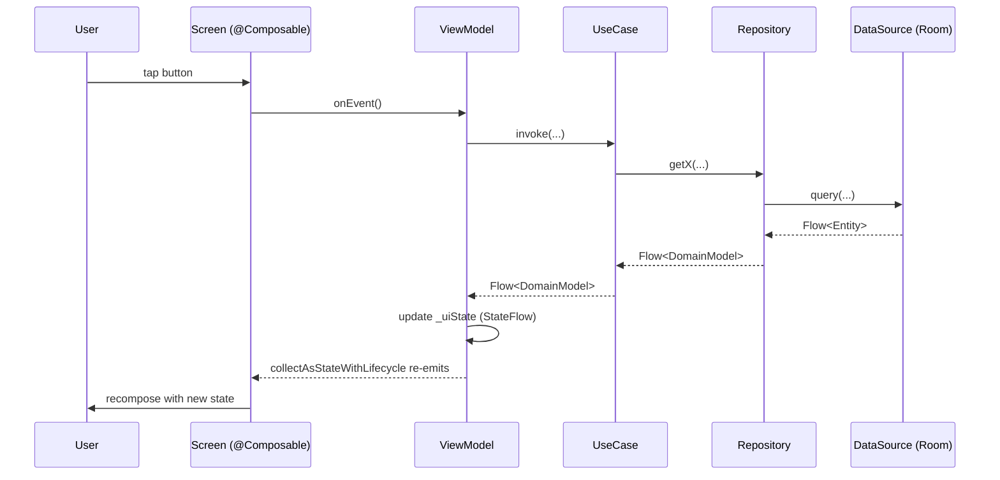

# Architecture

ConsultMe follows a **layered, multi-module** architecture aligned with Google's [`android/nowinandroid`](https://github.com/android/nowinandroid). Each layer has a clear seam, and modules communicate only through public APIs.

## Layers



The Presentation layer is Android. The Domain layer and `:core-common` are **pure-Kotlin** modules (`consultme.jvm.library`) — no Android SDK on the classpath, so framework imports won't compile there. The Data layer is Android (Room).

Note the direction of `:core-data → :core-domain`: because the domain layer is pure-Kotlin it can't depend on the Android data module, so the repository **port (interface) lives in `:core-domain`** and its **adapter (implementation) lives in `:core-data`** (ports & adapters). Features depend only on `:core-domain`; `:app` is the one module that pulls `:core-data` in, so Hilt can find the adapter binding at the top of the graph. `:core-data → :core-model` is transitive (via `:core-domain`'s `api` dependency).

`./gradlew moduleGraph` regenerates [`docs/MODULE_GRAPH.md`](docs/MODULE_GRAPH.md) — that file reflects the actual dep tree, including the `:baselineprofile` producer→`:app` consumer relationship.

## Module responsibilities

| Module | Layer | Belongs here | Doesn't belong |
|---|---|---|---|
| `:app` | Presentation root | `Application` class, navigation graph, top-level wiring, Hilt entry point | Screen logic — push to `:feature-*` |
| `:feature-*` | Presentation | Screens, ViewModels, screen-specific state and side-effects | Cross-feature shared composables (use `:core-ui`) |
| `:core-designsystem` | Presentation | Theme (`ConsultMeTheme`), color/typography/icon registries | Stateful composables, business logic |
| `:core-ui` | Presentation | Cross-feature stateless composables (loading, empty, error states, etc.) | Domain types, business logic |
| `:core-domain` | Domain (pure Kotlin) | Use-cases (`Get*UseCase`, …), repository **ports** (interfaces) | Android types, framework dependencies, repository *impls* |
| `:core-model` | Domain (pure Kotlin) | Pure data classes / sealed types | Logic, side-effects, persistence concerns |
| `:core-data` | Data | Repository **implementations** of `:core-domain` ports, entity ↔ domain mappers, network/database orchestration, Hilt `@Binds` | Database tables (those are in `:core-database`), repository interfaces (those are in `:core-domain`) |
| `:core-database` | Data | Room entities, DAOs, database class, DB Hilt module | Repository APIs, domain models |
| `:core-common` | Cross-cutting (pure Kotlin) | Dispatchers, qualifiers, generic utilities | Anything Android-specific |
| `:core-testing` | Cross-cutting | Test fixtures, dispatcher rule, Hilt test runner | Production code |
| `:baselineprofile` | Build-only producer | `BaselineProfileGenerator`, `StartupBenchmarks` | Anything that ships in `:app`'s release APK except `baseline-prof.txt` |

## Data flow (UDF)

A typical interaction — user taps a button, screen reflects new state:



State is **unidirectional**:

- **Events flow down** (`Screen → VM → UseCase → Repo → DataSource`).
- **State flows up** (`Repo → UseCase → VM → Screen`) as `Flow<T>`, lifted to `StateFlow<T>` at the VM boundary so Compose can collect with lifecycle awareness.

The `:feature-example` module ships a worked example of this pattern end-to-end at minimal scope: `ExampleViewModel` injects `GetExampleItemsUseCase` (`:core-domain`), which reads through the `ExampleRepository` port to `DefaultExampleRepository` (`:core-data`) and the Room `ExampleItemDao` (`:core-database`), mapping entities to `ExampleItem` (`:core-model`). The VM lifts that `Flow` into a `StateFlow<ExampleUiState>` (`Loading` / `Empty` / `Success`), and `ExampleScreen` collects it via `collectAsStateWithLifecycle()`.

## Stateless / stateful screen split

Each feature exposes **two overloads**:

```kotlin
// Stateful — used by the host activity / nav graph. Pulls a hilt-managed ViewModel.
@Composable
fun ExampleScreen(
    modifier: Modifier = Modifier,
    onItemClick: (ExampleItem) -> Unit = {},
    viewModel: ExampleViewModel = hiltViewModel(),
)

// Stateless — used by `@Preview` and Compose UI tests. No ViewModel coupling.
@Composable
fun ExampleScreen(uiState: ExampleUiState, onItemClick: (ExampleItem) -> Unit, modifier: Modifier = Modifier)
```

Why both:

- **Previews** can render every UI state without a Hilt graph — pass `ExampleUiState.Empty` or `ExampleUiState.Success(...)`, see what it looks like.
- **UI tests** of the stateless overload (`ExampleScreenTest`) are a one-liner: drive state via the parameter, assert what's on screen.
- **Stateful tests** (`ExampleScreenStatefulTest`) construct a real `ExampleViewModel` instance and pass it as `viewModel = ...`, exercising the full screen↔VM round-trip without needing Hilt.

## Navigation

The template uses **[Navigation 3](https://developer.android.com/guide/navigation/navigation-3)** — the app owns the back stack as a plain observable list of type-safe `NavKey`s. Navigation is owned by `:app`: it's the only module that knows about every feature, so it holds the back stack and composes each feature's destinations into a single `NavDisplay`.

Each feature exposes **`@Serializable` `NavKey` route types** and public screen composables; `:app` maps keys to screens:

```kotlin
// :feature-example  (route keys — arguments are constructor properties)
@Serializable data object ExampleListRoute : NavKey
@Serializable data class ExampleDetailRoute(val id: Long) : NavKey

// :app  (owns the back stack; one NavDisplay for the whole app)
val backStack = rememberNavBackStack(ExampleListRoute)
NavDisplay(
    backStack = backStack,
    onBack = { backStack.removeLastOrNull() },
    entryDecorators = listOf(
        rememberSaveableStateHolderNavEntryDecorator(),
        rememberViewModelStoreNavEntryDecorator(), // per-entry ViewModelStore for hiltViewModel()
    ),
    entryProvider = entryProvider {
        entry<ExampleListRoute> {
            ExampleScreen(onItemClick = { backStack.add(ExampleDetailRoute(it.id)) })
        }
        entry<ExampleDetailRoute> { key ->
            ExampleDetailScreen(itemId = key.id, onBack = { backStack.removeLastOrNull() })
        }
    },
)
```

Navigate by mutating the back stack (`backStack.add(key)` / `removeLastOrNull()`). Add destinations by adding a route `NavKey` in the feature and an `entry<…>` block in `:app`. **Never reach into a feature's internal composables** — go through the feature's public screen entry point.

**Passing arguments to a ViewModel**: `ExampleDetailViewModel` uses Hilt assisted injection to receive the route id — the `entry<ExampleDetailRoute>` block obtains it via `hiltViewModel<VM, VM.Factory>(creationCallback = { it.create(key.id) })`. The `rememberViewModelStoreNavEntryDecorator()` scopes each entry's ViewModel to that back-stack entry (cleared when it's popped).

## Why pure-Kotlin domain layers

`:core-model`, `:core-domain`, and `:core-common` use `consultme.jvm.library`, not `android.library`. Trade-off:

- **Build speed**: 5–10× faster compilation (no AGP, no resource processing, no R class).
- **Discipline**: Android SDK isn't on the classpath, so `import android.*` won't compile. Forces clean separation of concerns.
- **Test speed**: pure JUnit, no Robolectric or instrumentation needed.

The cost: Hilt `@Provides` modules (which reference `dagger.hilt.components.SingletonComponent`) live in `:app` or `:core-data`, not in `:core-common`. The qualifier *annotations* (`@Dispatcher(IO)`) live in `:core-common`; the *bindings* live next to the consumer.

## Cross-cutting conventions

- **Dispatchers**: `@Dispatcher(AppDispatchers.IO)` qualifier from `:core-common`. Adopters provide the binding (`@Provides @Dispatcher(IO) fun providesIo() = Dispatchers.IO`) wherever they apply Hilt.
- **State**: `Flow<T>` for streams, `Result<T>` for one-shot operations. Domain layer surfaces `Flow<DomainModel>` / `Result<DomainModel>`, never raw DTOs or `Response<T>`.
- **Theme**: feature modules pull `:core-designsystem` automatically via the `consultme.android.feature` convention plugin — don't redeclare.
- **Coverage**: Kover instruments every module that applies an `consultme.android.*` or `consultme.jvm.library` convention. Generated Hilt/Room/Compose code is excluded in `consultme.kover.gradle.kts` so the metric reflects real coverage.
