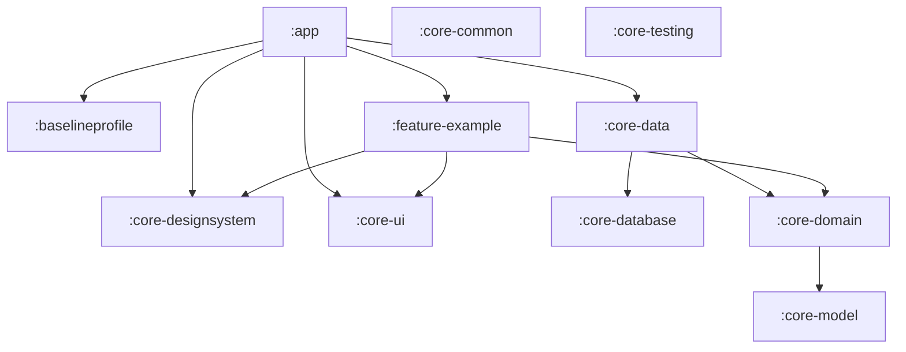

# Module dependency graph

Generated by `./gradlew moduleGraph`. Do not edit by hand.

```mermaid
graph TD
  :app --> :baselineprofile
  :app --> :core-data
  :app --> :core-designsystem
  :app --> :core-ui
  :app --> :feature-example
  :core-data --> :core-database
  :core-data --> :core-domain
  :core-domain --> :core-model
  :feature-example --> :core-designsystem
  :feature-example --> :core-domain
  :feature-example --> :core-ui
  :core-common
  :core-testing
```
